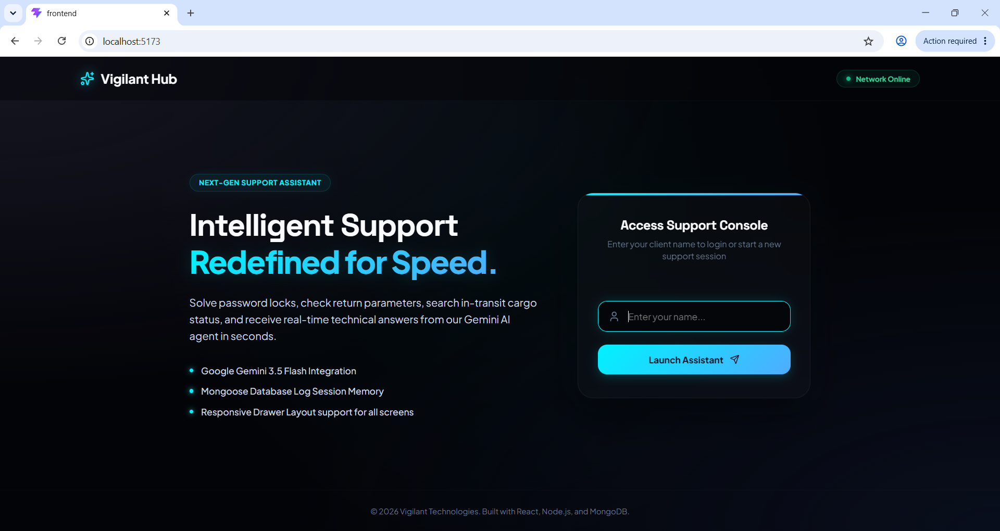
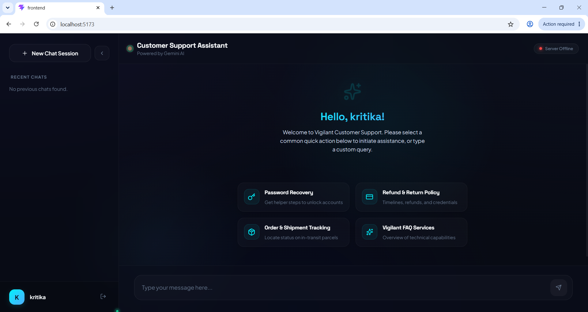
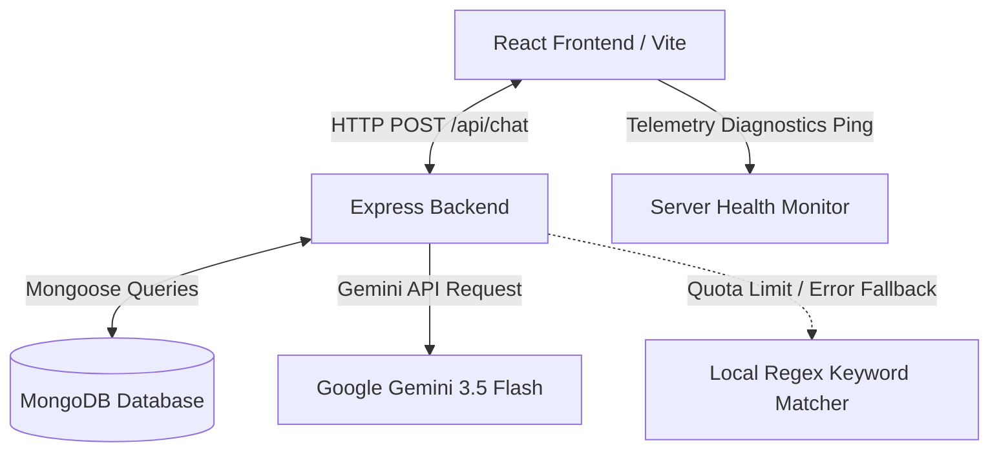

# 🤖 Cyvigilant: AI-Powered Customer Support Portal

<p align="center">
  
  
  
  
  
  
</p>

A premium, full-stack, glassmorphic AI Customer Support Assistant built with **React (Vite)**, **Express.js**, **MongoDB**, and **Google Gemini 3.5 Flash**. 

This system demonstrates production-ready features such as **telemetry latency diagnostics**, **resilient offline local failbacks**, **interactive micro-animations**, **dynamic markdown rendering**, and a clean **Mongoose architecture**.

---

## 📷 Visual Preview

### 1. Onboarding & Access Support Console
The landing page greets users with a sleek, premium dark-mode portal featuring frosted glass panels, active connection status monitoring, and clear features lists.



### 2. Collapsible Support Dashboard
Once logged in, users gain access to a ChatGPT-style conversation dashboard. Features include dynamic sidebar navigation, conversation thread management, quick action templates, and auto-expanding input zones.



---

## ✨ Core Features

### 🖥️ High-Fidelity Glassmorphic Onboarding
*   **Frosted Glass Elements**: Uses premium glassmorphic styling, vibrant neon accent highlights, and smooth fade-in animations.
*   **User Sessions**: Allows users to enter a custom client username to isolate and authenticate their own chat threads.

### 💬 Conversational Workspace
*   **ChatGPT-Style Sidebar**: A fully collapsible list of user-specific chat histories. Minimizes to a clean 80px dock to maximize room for response reading.
*   **Quick Suggestions**: Clicking suggestion chips automatically dispatches pre-crafted inquiries like *Refund & Return Policy*, *Password Recovery*, and *Order Status* for swift navigation.
*   **Bouncing Thinking Indicator**: Provides real-time visual feedback using pulsing dots during AI generation cycles.
*   **Accent Markdown Renderer**: Rich AI text response bubbles render clean headers, bullet lists, code blocks, and neon-blue highlighted bold strings.
*   **Micro-Interactions**: Features a copy-to-clipboard action button with a 2-second checkmark verification transition.

### 🛡️ Payload Schema & Telemetry
*   **Input Validation**: Rejects malformed payload models, blank usernames, or empty prompt arguments before dispatching to LLM APIs.
*   **Real-time Latency telemetry**: Continuously pings server backend systems in the background to calculate round-trip query time, updating a live connectivity pill (`Connected • 32ms`) in the UI console header.

---

## 🏗️ System Architecture

The following flow represents the application sequence:



### Directory Structure

```text
cyvigilant/
├── backend/
│   ├── config/          # Database connection (db.js)
│   ├── models/          # Mongoose collection models (Conversation.js)
│   ├── routes/          # Express API controllers (chat.js)
│   ├── .env.example     # Environment variable blueprint
│   └── server.js        # Backend entry server script
├── frontend/
│   ├── public/          # Static browser assets
│   ├── src/
│   │   ├── assets/      # Hero images and branding assets
│   │   ├── App.jsx      # Core React view controller and state management
│   │   ├── index.css    # High-fidelity global styling, vars & utility classes
│   │   └── main.jsx     # Frontend DOM mount
│   └── package.json
├── screenshot/          # High-fidelity visual PNG captures
└── README.md            # Modern Documentation Portal
```

---

## 📊 Database Design

We store conversations in a single collection document in **MongoDB**, modeled using **Mongoose** to maximize querying speed and avoid expensive joins:

```javascript
const ConversationSchema = new mongoose.Schema({
  username: { type: String, required: true, trim: true },
  messages: [
    {
      sender: { type: String, enum: ['user', 'ai'], required: true },
      text: { type: String, required: true },
      timestamp: { type: Date, default: Date.now }
    }
  ],
  createdAt: { type: Date, default: Date.now }
});
```

| Field Name | Type | Description | Required |
| :--- | :--- | :--- | :---: |
| `username` | `String` | Unique client username session filter | Yes |
| `messages` | `Array` | Nested messages array for single-query loads | Yes |
| `messages.sender` | `String` | Entity category (`user` or `ai`) | Yes |
| `messages.text` | `String` | Core message content | Yes |
| `createdAt` | `Date` | Timestamp representing initialization date | Yes |

---

## 🚀 Installation & Quick Start

### 1. Prerequisites
Ensure you have the following installed on your machine:
*   [Node.js](https://nodejs.org/) (v18.0.0 or higher)
*   [MongoDB Community Server](https://www.mongodb.com/try/download/community) (Running locally on default port `27017`)

### 2. Configure Environment Settings
1. Make a copy of the backend environment template:
   ```bash
   cp backend/.env.example backend/.env
   ```
2. Open `backend/.env` and update the database connection URI or input your Gemini API credentials:
   ```env
   PORT=5000
   MONGODB_URI=mongodb://127.0.0.1:27017/ai_support_assistant
   GEMINI_API_KEY=your_gemini_api_key_here
   ```

### 3. Start Backend Services
Navigate to the server directory, install packages, and boot the server in dev mode:
```bash
cd backend
npm install
npm run dev
```
The server will bind to port `5000` and connect to the local MongoDB daemon.

### 4. Start React Frontend Client
Open a second terminal window, navigate to the frontend directory, install packages, and launch the Vite dev server:
```bash
cd frontend
npm install
npm run dev
```
Open **`http://localhost:5173/`** to access the Cyvigilant Console!

---

## 🛡️ Resilient Fail-Safe Modes

### Offline Regex Keyword Matcher
If the Gemini API key runs out of quota, is invalid, or has no internet connection, Cyvigilant falls back to a locally operated keyword classification framework automatically:
*   **Seamless Transition**: Employs backend exception catching to prevent route failure.
*   **Regex Engine**: Matches keywords (e.g., `refund`, `password`, `shipment`, `status`) to return rich, structured fallback response models with instructions, status diagnostics, and warnings.
*   **Safety Warning Banner**: Displays an informative notice to indicate fallback mode is active while keeping the portal fully responsive.

---

## 🔗 API Route Reference

### 1. Send/Continue Conversation Thread
*   **Route**: `POST /api/chat`
*   **Payload Schema**:
    ```json
    {
      "username": "Kritika",
      "message": "I want to request a refund",
      "conversationId": "66ac39527..." // Optional. Leave blank to start a new chat session.
    }
    ```
*   **Success Response (200 OK)**:
    ```json
    {
      "success": true,
      "conversationId": "66ac39527...",
      "reply": "Our refund policy allows requests within 30 days...",
      "messages": [
        { "sender": "user", "text": "I want to request a refund", "timestamp": "..." },
        { "sender": "ai", "text": "Our refund policy allows...", "timestamp": "..." }
      ]
    }
    ```

### 2. Retrieve All Conversation Summaries
*   **Route**: `GET /api/chat/history?username=Kritika`
*   **Success Response (200 OK)**:
    ```json
    [
      {
        "_id": "66ac39527...",
        "username": "Kritika",
        "lastMessage": "I want to request a refund",
        "createdAt": "2026-08-02T20:00:00.000Z"
      }
    ]
    ```

### 3. Fetch Full Chat History Details
*   **Route**: `GET /api/chat/history/:id`
*   **Success Response (200 OK)**:
    ```json
    {
      "_id": "66ac39527...",
      "username": "Kritika",
      "messages": [ ... ],
      "createdAt": "2026-08-02T20:00:00.000Z"
    }
    ```

### 4. Delete Chat Thread
*   **Route**: `DELETE /api/chat/history/:id`
*   **Success Response (200 OK)**:
    ```json
    {
      "success": true,
      "message": "Conversation deleted successfully"
    }
    ```

---

## 🩺 System Diagnostics & Troubleshooting

*   **Database connection failures**: Ensure the MongoDB service is active. Run `mongod` or check `services.msc` on Windows to make sure MongoDB is running.
*   **Gemini API issues**: If you encounter timeouts or quota errors, verify that `GEMINI_API_KEY` in `backend/.env` is correct. The app will automatically default to fallback offline regex mode if the API fails.